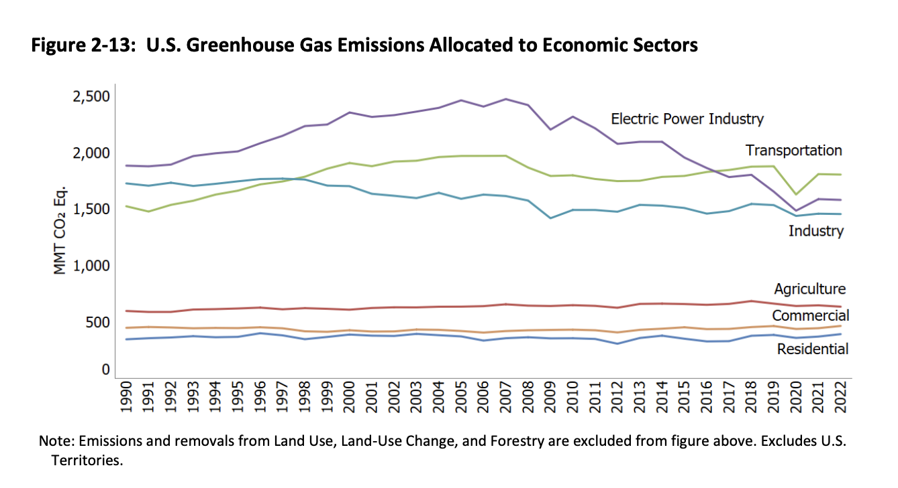

\newpage
\tableofcontents 
\newpage
\listoftables 
\newpage
\listoffigures 
\newpage

```{r setup, include=FALSE}
# Set your working directory

# Load your packages
library(tidyverse);library(lubridate);library(here);library(sf);
library(ggnewscale);library(cowplot);library(viridis)
here()

# Set your ggplot theme

# Load your datasets

#Air Quality
TXPM2523 <- read.csv(here("Data/TXPM2523.csv"))
TXPM2522 <- read.csv(here("Data/TXPM2522.csv"))
TXPM2521 <- read.csv(here("Data/TXPM2521.csv"))
TXPM2520 <- read.csv(here("Data/TXPM2520.csv"))
TXPM2519 <- read.csv(here("Data/TXPM2519.csv"))
TXOzone23 <- read.csv(here("Data/TXOzone23.csv"))
TXOzone22 <- read.csv(here("Data/TXOzone22.csv"))
TXOzone21 <- read.csv(here("Data/TXOzone21.csv"))
TXOzone20 <- read.csv(here("Data/TXOzone20.csv"))
TXOzone19 <- read.csv(here("Data/TXOzone19.csv"))

#eGRID

#Any data that was blank (""), a space (" "), or 0 was converted to NA for consistency and to ensure as.numeric worked properly
#First row is sliced because it is the short form of the column name

eGRID23_PLNT <- read.csv(here("Data/egrid2023_data_rev2_PLNT.csv"),
                         na.strings = c("", " ", "0")) %>% slice(-1) 

eGRID22_PLNT <- read.csv(here("Data/egrid2022_data_PLNT.csv"),
                         na.strings = c("", " ", "0")) %>% slice(-1) 

eGRID21_PLNT <- read.csv(here("Data/eGRID2021_data_PLNT.csv"),
                         na.strings = c("", " ", "0")) %>% slice(-1) 

eGRID20_PLNT <- read.csv(here("Data/eGRID2020_Data_v2_PLNT.csv"),
                         na.strings = c("", " ", "0")) %>% slice(-1) 

eGRID19_PLNT <- read.csv(here("Data/egrid2019_data_PLNT.csv"),
                         na.strings = c("", " ", "0")) %>% slice(-1) 

#ADD PRECIPITATION
```


# Rationale and Research Questions
This report examines how local conditions affect local air quality, focusing on power plant emissions and precipitation levels. In the figure below (EPA 2024), U.S. greenhouse gas emissions allocated to economic sectors are shown. Most economic sectors show relatively stable emissions across time, except for the electric power industry, thus our emissions data is focused from this sector. While pollution is often studied at a global level, examining its contribution to climate change and warming temperatures, its affect on communities local to the emissions source is studied less frequently. This analysis considers other factors (precipitation) that may influence air quality and explores how air quality levels vary day-to-day. Texas was chosen as the study area for this analysis because of its number of power plants and counties. This report investigates the following three questions:

1) Is there a correlation between county level emission levels from power plants and county air quality in Texas?
2) Is there a trend in air quality values and emissions over time in Harris county, Texas?
3) Is there a relationship between precipitation and air quality between and within the counties of Harris and Dallas in Texas?



\newpage

# Dataset Information

This report analyzes three sources of data: EPA Air Quality, Emissions & Generation Resource Integrated Database (eGRID), and National Oceanic and Atmospheric Administration via National Centers for Environmental Information.

EPA Air Quality Data is collected at local monitors across the United States. It can be downloaded by pollutant type, region, and year. This report uses data for Texas between 2018 and 2023 for PM2.5 and Ozone. PM2.5 and Ozone are two criteria pollutants that can cause respiratory issues, especially for people with pre-existing health conditions, children, and seniors. The AQI based on PM2.5 and Ozone are recorded separately and range on a scale from 0-500, with higher values being more dangerous. Values 0-50 indicate "Good" AQ, 50 - 100 "Moderate", and increasingly poor from there. For more information about Air Quality Index and criteria pollutants, visit https://www.epa.gov/outdoor-air-quality-data/air-data-basic-information

eGRID data is released annually and contains information for all power plants across the United States. It contains information about generation, age of the plant, fuel type, and emissions, including CO2 Equivalent emissions. This report uses the eGRID 2018 - 2023 annual reports and focuses only on Texas power plants. 

The National Oceanic and Atmospheric Administration provides public data via the National Centers for Environmental Information. The information pulled for this report included precipitation data in inches from 44 monitoring stations in Dallas county and 83 monitoring stations in Harris county. The dates spanned 2019 - 2023.

\newpage

# Exploratory Analysis 
This report analyzes air quality data from 2019 - 2023 in Texas for both PM2.5 and Ozone. For each year, there are separate PM2.5 and Ozone files, but the structure is the same for all. Below is the structure of the 2019 Texas PM2.5 data.
```{r Air Quality Data, echo=FALSE}
str(TXPM2519)
```


\newpage

# Analysis

## Question 1: Is there a correlation between county level emission levels from power plants and county air quality?
The eGRID data for each year was adjusted to ensure all numeric columns were imported as numeric for quantitative analysis. The year, state, plant name, county, latitude, longitude, and emissions data for all types of recorded emissions (including CO2 equivalent emissions) were selected to a new data frame. These data frames were combined and further manipulated to have a data frame with the total county emissions for each year.

```{r Q1 eGRID Data Wrangling, include=FALSE}
#Read in each year of eGRID data selecting relevant columns and adjusting 
#data types for each column. 
eGRID23_PLNT_E <- eGRID23_PLNT %>% 
  mutate(Data.Year=as.Date(paste0(Data.Year, "-01-01"))) %>% 
  mutate(Plant.latitude=as.numeric(Plant.latitude)) %>% 
  mutate(Plant.longitude=as.numeric(Plant.longitude)) %>%
  mutate(Plant.annual.NOx.emissions..tons.=as.numeric(
    Plant.annual.NOx.emissions..tons.)) %>% 
  mutate(Plant.annual.SO2.emissions..tons.=as.numeric(
    Plant.annual.SO2.emissions..tons.)) %>% 
  mutate(Plant.annual.CO2.emissions..tons.=as.numeric(
    Plant.annual.CO2.emissions..tons.)) %>% 
  mutate(Plant.annual.CH4.emissions..lbs.=as.numeric(
    Plant.annual.CH4.emissions..lbs.)) %>% 
  mutate(Plant.annual.N2O.emissions..lbs.=as.numeric(
    Plant.annual.N2O.emissions..lbs.)) %>% 
  mutate(Plant.annual.CO2.equivalent.emissions..tons.=as.numeric(
    Plant.annual.CO2.equivalent.emissions..tons.)) %>% 
  mutate(Plant.annual.Hg.emissions..lbs.=as.numeric(
    Plant.annual.Hg.emissions..lbs.)) %>% 
  select("Data.Year", "Plant.state.abbreviation", "Plant.name", 
         "Plant.county.name", "Plant.latitude", "Plant.longitude", 
         "Plant.primary.fuel","Plant.annual.NOx.emissions..tons.",
         "Plant.annual.SO2.emissions..tons.", "Plant.annual.CO2.emissions..tons.",
         "Plant.annual.CH4.emissions..lbs.","Plant.annual.N2O.emissions..lbs.", 
         "Plant.annual.CO2.equivalent.emissions..tons.", 
         "Plant.annual.Hg.emissions..lbs.")  

eGRID22_PLNT_E <- eGRID22_PLNT %>% 
  mutate(Data.Year=as.Date(paste0(Data.Year, "-01-01"))) %>% 
  mutate(Plant.latitude=as.numeric(Plant.latitude)) %>% 
  mutate(Plant.longitude=as.numeric(Plant.longitude)) %>%
  mutate(Plant.annual.NOx.emissions..tons.=as.numeric(
    Plant.annual.NOx.emissions..tons.)) %>% 
  mutate(Plant.annual.SO2.emissions..tons.=as.numeric(
    Plant.annual.SO2.emissions..tons.)) %>% 
  mutate(Plant.annual.CO2.emissions..tons.=as.numeric(
    Plant.annual.CO2.emissions..tons.)) %>% 
  mutate(Plant.annual.CH4.emissions..lbs.=as.numeric(
    Plant.annual.CH4.emissions..lbs.)) %>% 
  mutate(Plant.annual.N2O.emissions..lbs.=as.numeric(
    Plant.annual.N2O.emissions..lbs.)) %>% 
  mutate(Plant.annual.CO2.equivalent.emissions..tons.=as.numeric(
    Plant.annual.CO2.equivalent.emissions..tons.)) %>% 
  mutate(Plant.annual.Hg.emissions..lbs.=as.numeric(
    Plant.annual.Hg.emissions..lbs.)) %>% 
  select("Data.Year", "Plant.state.abbreviation", "Plant.name", 
         "Plant.county.name", "Plant.latitude", "Plant.longitude", 
         "Plant.primary.fuel","Plant.annual.NOx.emissions..tons.",
         "Plant.annual.SO2.emissions..tons.", "Plant.annual.CO2.emissions..tons.",
         "Plant.annual.CH4.emissions..lbs.","Plant.annual.N2O.emissions..lbs.", 
         "Plant.annual.CO2.equivalent.emissions..tons.", 
         "Plant.annual.Hg.emissions..lbs.")

eGRID21_PLNT_E <- eGRID21_PLNT %>% 
  mutate(Data.Year=as.Date(paste0(Data.Year, "-01-01"))) %>% 
    mutate(Plant.latitude=as.numeric(Plant.latitude)) %>% 
    mutate(Plant.longitude=as.numeric(Plant.longitude)) %>%
    mutate(Plant.annual.NOx.emissions..tons.=as.numeric(
      Plant.annual.NOx.emissions..tons.)) %>% 
    mutate(Plant.annual.SO2.emissions..tons.=as.numeric(
      Plant.annual.SO2.emissions..tons.)) %>% 
    mutate(Plant.annual.CO2.emissions..tons.=as.numeric(
      Plant.annual.CO2.emissions..tons.)) %>% 
    mutate(Plant.annual.CH4.emissions..lbs.=as.numeric(
      Plant.annual.CH4.emissions..lbs.)) %>% 
    mutate(Plant.annual.N2O.emissions..lbs.=as.numeric(
      Plant.annual.N2O.emissions..lbs.)) %>% 
    mutate(Plant.annual.CO2.equivalent.emissions..tons.=as.numeric(
      Plant.annual.CO2.equivalent.emissions..tons.)) %>% 
    mutate(Plant.annual.Hg.emissions..lbs.=as.numeric(
      Plant.annual.Hg.emissions..lbs.)) %>% 
  select("Data.Year", "Plant.state.abbreviation", "Plant.name", 
         "Plant.county.name", "Plant.latitude", "Plant.longitude", 
         "Plant.primary.fuel","Plant.annual.NOx.emissions..tons.",
         "Plant.annual.SO2.emissions..tons.", "Plant.annual.CO2.emissions..tons.",
         "Plant.annual.CH4.emissions..lbs.","Plant.annual.N2O.emissions..lbs.", 
         "Plant.annual.CO2.equivalent.emissions..tons.", 
         "Plant.annual.Hg.emissions..lbs.")


eGRID20_PLNT_E <- eGRID20_PLNT %>% 
  mutate(Data.Year=as.Date(paste0(Data.Year, "-01-01"))) %>% 
  mutate(Plant.latitude=as.numeric(Plant.latitude)) %>% 
  mutate(Plant.longitude=as.numeric(Plant.longitude)) %>%
  mutate(Plant.annual.NOx.emissions..tons.=as.numeric(
    Plant.annual.NOx.emissions..tons.)) %>% 
  mutate(Plant.annual.SO2.emissions..tons.=as.numeric(
    Plant.annual.SO2.emissions..tons.)) %>% 
  mutate(Plant.annual.CO2.emissions..tons.=as.numeric(
    Plant.annual.CO2.emissions..tons.)) %>% 
  mutate(Plant.annual.CH4.emissions..lbs.=as.numeric(
    Plant.annual.CH4.emissions..lbs.)) %>% 
  mutate(Plant.annual.N2O.emissions..lbs.=as.numeric(
    Plant.annual.N2O.emissions..lbs.)) %>% 
  mutate(Plant.annual.CO2.equivalent.emissions..tons.=as.numeric(
    Plant.annual.CO2.equivalent.emissions..tons.)) %>% 
  mutate(Plant.annual.Hg.emissions..lbs.=as.numeric(
    Plant.annual.Hg.emissions..lbs.)) %>% 
  select("Data.Year", "Plant.state.abbreviation", "Plant.name", 
         "Plant.county.name", "Plant.latitude", "Plant.longitude", 
         "Plant.primary.fuel","Plant.annual.NOx.emissions..tons.",
         "Plant.annual.SO2.emissions..tons.", "Plant.annual.CO2.emissions..tons.",
         "Plant.annual.CH4.emissions..lbs.","Plant.annual.N2O.emissions..lbs.", 
         "Plant.annual.CO2.equivalent.emissions..tons.", 
         "Plant.annual.Hg.emissions..lbs.")

eGRID19_PLNT_E <- eGRID19_PLNT %>% 
  mutate(Data.Year=as.Date(paste0(Data.Year, "-01-01"))) %>% 
  mutate(Plant.latitude=as.numeric(Plant.latitude)) %>% 
  mutate(Plant.longitude=as.numeric(Plant.longitude)) %>%
  mutate(Plant.annual.NOx.emissions..tons.=as.numeric(
    Plant.annual.NOx.emissions..tons.)) %>% 
  mutate(Plant.annual.SO2.emissions..tons.=as.numeric(
    Plant.annual.SO2.emissions..tons.)) %>% 
  mutate(Plant.annual.CO2.emissions..tons.=as.numeric(
    Plant.annual.CO2.emissions..tons.)) %>% 
  mutate(Plant.annual.CH4.emissions..lbs.=as.numeric(
    Plant.annual.CH4.emissions..lbs.)) %>% 
  mutate(Plant.annual.N2O.emissions..lbs.=as.numeric(
    Plant.annual.N2O.emissions..lbs.)) %>% 
  mutate(Plant.annual.CO2.equivalent.emissions..tons.=as.numeric(
    Plant.annual.CO2.equivalent.emissions..tons.)) %>% 
  mutate(Plant.annual.Hg.emissions..lbs.=as.numeric(
    Plant.annual.Hg.emissions..lbs.)) %>% 
  select("Data.Year", "Plant.state.abbreviation", "Plant.name", 
         "Plant.county.name", "Plant.latitude", "Plant.longitude", 
         "Plant.primary.fuel","Plant.annual.NOx.emissions..tons.",
         "Plant.annual.SO2.emissions..tons.", "Plant.annual.CO2.emissions..tons.",
         "Plant.annual.CH4.emissions..lbs.","Plant.annual.N2O.emissions..lbs.", 
         "Plant.annual.CO2.equivalent.emissions..tons.", 
         "Plant.annual.Hg.emissions..lbs.")

#Combine all eGRID years into one dataframe
eGRID_PLNT_E <- rbind (eGRID23_PLNT_E, eGRID22_PLNT_E, eGRID21_PLNT_E, 
                       eGRID20_PLNT_E,eGRID19_PLNT_E)

#Texas plants with reported CO2 emissions
eGRID_TX_indiv_CO2eq <- eGRID_PLNT_E %>% 
  filter(Plant.state.abbreviation == "TX") %>% 
  select("Data.Year","Plant.name", "Plant.county.name", "Plant.latitude", "Plant.longitude","Plant.annual.CO2.equivalent.emissions..tons.") %>% 
  na.omit()

#All Texas plants, location only
eGRID_TX_indiv_location_only <- eGRID_PLNT_E %>% 
  filter(Plant.state.abbreviation == "TX") %>% 
  group_by(Plant.latitude, Plant.longitude) %>% 
  select("Plant.latitude", "Plant.longitude") %>% 
  na.omit()

#Locations of Texas plants that have reported emissions
eGRID_TX_locations <- eGRID_TX_indiv_CO2eq %>% 
  group_by(Plant.latitude, Plant.longitude) %>% 
  summarize(AVG.CO2 = mean(Plant.annual.CO2.equivalent.emissions..tons.)) %>% 
  na.omit()

#Total emissions per county per year in Texas
eGRID_PLNT_TX_E <- eGRID_TX_indiv_CO2eq %>% 
  group_by(Data.Year,Plant.county.name) %>% 
  summarize(CO2_Equiv = sum(Plant.annual.CO2.equivalent.emissions..tons.)) %>% 
  na.omit() %>% 
  rename(Date = Data.Year) %>% 
  rename(County = Plant.county.name)
```

Relevant columns were selected for each of the PM2.5 and Ozone data frames, including date AQI, site name, AQ type (PM2.5 or Ozone), State, County, longitude and latitude. This was combined into two dataframes, one for PM2.5 and one for Ozone and further manipulated to have data frames with the average air quality value for each county each year. 

```{r Q1 AQ Data Wrangling, include=FALSE}
#Texas PM2.5 for each year. Formatted into yearly rather than daily data
TXPM2523_E <- TXPM2523 %>% 
  mutate(Date=mdy(Date)) %>% 
  select("Date", "Daily.AQI.Value", "Local.Site.Name", 
         "AQS.Parameter.Description", "State", "County", 
         "Site.Latitude", "Site.Longitude") %>% 
  mutate(Year = year(Date)) %>% 
  mutate(Date=as.Date(paste0(Year, "-01-01")))

TXPM2522_E <- TXPM2522 %>% 
  mutate(Date=mdy(Date)) %>% 
  select("Date", "Daily.AQI.Value", "Local.Site.Name", 
         "AQS.Parameter.Description", "State", "County", 
         "Site.Latitude", "Site.Longitude") %>% 
  mutate(Year = year(Date)) %>% 
  mutate(Date=as.Date(paste0(Year, "-01-01")))

TXPM2521_E <- TXPM2521 %>% 
  mutate(Date=mdy(Date)) %>% 
  select("Date", "Daily.AQI.Value", "Local.Site.Name", 
         "AQS.Parameter.Description", "State", "County", 
         "Site.Latitude", "Site.Longitude") %>% 
  mutate(Year = year(Date)) %>% 
  mutate(Date=as.Date(paste0(Year, "-01-01")))

TXPM2520_E <- TXPM2520 %>% 
  mutate(Date=mdy(Date)) %>% 
  select("Date", "Daily.AQI.Value", "Local.Site.Name", 
         "AQS.Parameter.Description", "State", "County", 
         "Site.Latitude", "Site.Longitude") %>% 
  mutate(Year = year(Date)) %>% 
  mutate(Date=as.Date(paste0(Year, "-01-01")))

TXPM2519_E <- TXPM2519 %>% 
  mutate(Date=mdy(Date)) %>% 
  select("Date", "Daily.AQI.Value", "Local.Site.Name",
         "AQS.Parameter.Description", "State", "County", 
         "Site.Latitude", "Site.Longitude") %>% 
  mutate(Year = year(Date)) %>% 
  mutate(Date=as.Date(paste0(Year, "-01-01")))

#Average annual PM2.5 in Texas by County
TXPM25 <- rbind(TXPM2519_E, TXPM2520_E, TXPM2521_E, TXPM2522_E, TXPM2523_E)
TXPM25_CNTY <- TXPM25 %>% 
  group_by(Date, County) %>% 
  summarize(Avg_AQI_PM25 = mean(Daily.AQI.Value))

#Texas Ozone for each year. Formatted into yearly rather than daily data
TXOzone23_E <- TXOzone23 %>% 
  mutate(Date=mdy(Date)) %>% 
  select("Date", "Daily.AQI.Value", "Local.Site.Name",
         "AQS.Parameter.Description", "State", "County", "Site.Latitude", 
         "Site.Longitude") %>% 
  mutate(Year = year(Date)) %>% 
  mutate(Date=as.Date(paste0(Year, "-01-01")))

TXOzone22_E <- TXOzone22 %>% 
  mutate(Date=mdy(Date)) %>% 
  select("Date", "Daily.AQI.Value", "Local.Site.Name", 
         "AQS.Parameter.Description", "State", "County", 
         "Site.Latitude", "Site.Longitude") %>% 
  mutate(Year = year(Date)) %>% 
  mutate(Date=as.Date(paste0(Year, "-01-01")))

TXOzone21_E <- TXOzone21 %>% 
  mutate(Date=mdy(Date)) %>% 
  select("Date", "Daily.AQI.Value", "Local.Site.Name", 
         "AQS.Parameter.Description", "State", "County", "Site.Latitude", 
         "Site.Longitude") %>% 
  mutate(Year = year(Date)) %>% 
  mutate(Date=as.Date(paste0(Year, "-01-01")))

TXOzone20_E <- TXOzone20 %>% 
  mutate(Date=mdy(Date)) %>% 
  select("Date", "Daily.AQI.Value", "Local.Site.Name", 
         "AQS.Parameter.Description", "State", "County", 
         "Site.Latitude", "Site.Longitude") %>% 
  mutate(Year = year(Date)) %>% 
  mutate(Date=as.Date(paste0(Year, "-01-01")))

TXOzone19_E <- TXOzone19 %>% 
  mutate(Date=mdy(Date)) %>% 
  select("Date", "Daily.AQI.Value", "Local.Site.Name", 
         "AQS.Parameter.Description", "State", "County", 
         "Site.Latitude", "Site.Longitude") %>% 
  mutate(Year = year(Date)) %>% 
  mutate(Date=as.Date(paste0(Year, "-01-01")))

#Average annual Ozone in Texas by County
TXOzone <- rbind(TXOzone19_E, TXOzone20_E, TXOzone21_E, TXOzone22_E, 
                 TXOzone23_E)
TXOzone_CNTY <- TXOzone %>% 
  group_by(Date, County) %>% 
  summarize(Avg_AQI_Ozone = mean(Daily.AQI.Value))
```

The data frames were joined to have a data frame with, for each year and each county, total emissions and average AQI.
```{r include=FALSE}
#Annual average AQI (ozone and PM2.5) and total emissions per county
TXEmissions_PM25 <- left_join(TXPM25_CNTY, eGRID_PLNT_TX_E, 
                              by = c("Date", "County")) %>% 
  na.omit()


TXEmissions_Ozone <- left_join(TXOzone_CNTY, eGRID_PLNT_TX_E, 
                              by = c("Date", "County")) %>% 
  na.omit()
```


```{r Q1 Spatial Data Wrangling, include=FALSE}
#Map of Texas counties
Texas_Counties <- st_read(here('Data/cb_2018_us_county_20m.shp')) %>% 
  filter(STATEFP == 48)

#Locations of all Texas plants (reporting and not)
ALLPlant_Locations <- st_as_sf(eGRID_TX_indiv_location_only,
    coords = c('Plant.longitude','Plant.latitude'),
    crs = 4326)

#Locations of reporting plants only
Plant_Locations <- st_as_sf(eGRID_TX_locations,
    coords = c('Plant.longitude','Plant.latitude'),
    crs = 4326)

#Locations of Ozone monitors
TXOzone_locations <- TXOzone %>% 
  group_by(Site.Latitude, Site.Longitude) %>% 
  summarize(AVGAQI.O3 = mean(Daily.AQI.Value))
  
Ozone_Locations <- st_as_sf(TXOzone_locations,
    coords = c('Site.Longitude','Site.Latitude'),
    crs = 4326) 

#Locations of PM2.5 monitors
TXPM25_locations <- TXPM25 %>% 
  group_by(Site.Latitude, Site.Longitude) %>% 
  summarize(AVGAQI.PM25 = mean(Daily.AQI.Value))
  
PM25_Locations <- st_as_sf(TXPM25_locations,
    coords = c('Site.Longitude','Site.Latitude'),
    crs = 4326) 

```

\newpage
### How often is emissions data reported?

The following map displays all the plants referenced in at least one of the eGRID reports between 2019 and 2023. Not all plants listed in eGRID report CO2 equivalence. The plants that reported at some point in the 5 years are in blue. Plants that are listed in a least one of the eGRID reports but never report CO2 emissions (or have zero emissions) are in black.

```{r Q1 Map1, echo=FALSE, warning=FALSE, f.align = "left", fig.cap="Listed and Emissions Reporting Texas Power Plants. 2019 - 2023 eGRID reports."}
#Map of reporting and not reporting Texas plants
ggplot()+
  geom_sf(data = Texas_Counties)+
  geom_sf(data = ALLPlant_Locations, 
          aes(color = "Non-Emissions Reporting Plants"),
          size = 0.5)+  
  scale_color_manual(name = "", 
                     values = c("Non-Emissions Reporting Plants" = "Black"))+
  new_scale_color()+
  geom_sf(data = Plant_Locations, aes(color = "Emissions Reporting Plants"), 
          size = 0.5)+
  scale_color_manual(name = "", 
                     values = c("Emissions Reporting Plants" = "Blue"))

```

\newpage

### How are air quality stations spatially located compared to emissions reporting power plants?
The following map shows how plants and EPA air quality monitors are spatially related. Not all counties have both an air quality monitor and at least one CO2 equivalence reporting plant. Only counties reporting emissions and air quality at some point between 2019 and 2023 are included in the spatial analysis below.

```{r Q1 Map2, echo=FALSE, warning=FALSE, fig.cap = "Air Quality Monitors & Annual Emissions from Power Plants and in Texas, 2019 - 2023."}
#Map of reporting Texas plants and ozone/PM2.5 monitors
ggplot() +
  geom_sf(data = Texas_Counties)+
  geom_sf(data = Plant_Locations, color = "blue",shape = 21,fill=NA,stroke=0.2, 
          aes(color = "Reporting Plants", size=AVG.CO2))+
  geom_sf(data = Ozone_Locations,size=0.5, aes(color = "Ozone Monitor"))+
  scale_color_manual(name = "", values = c("Ozone Monitor" = "Red"))+
  new_scale_color()+
  geom_sf(data = PM25_Locations, size=0.5, aes(color = "PM2.5 Monitor"))+ 
  scale_color_manual(name = "Air Quality Monitor Type", 
                     values = c("PM2.5 Monitor" = "Green"))+
  new_scale_color()+
  labs(size="Average Annual CO2 Equivalent (tons)")
```

\newpage
### Are annual county emissions correlated with annual county air quality?
The following graphs and tables show the relationship between total annual county emissions and average annual county air quality. A linear regression was run on the data to determine if the relationship has a significant correlation. Harris County data points are highlighted.

```{r Q1 Emissions vs Ozone, echo=FALSE, fig.cap="Average Daily Ozone AQI Value vs. Annual CO2 Equivalent Emissions (tons). Per Texas County, 2019 - 2023", warning=FALSE}
#Graph of emissions vs ozone
Emissions_O3 <- TXEmissions_Ozone %>% 
  ggplot(aes(x = CO2_Equiv, y = Avg_AQI_Ozone))+
  geom_point(aes(color = Date))+
  #geom_text(data = TXEmissions_Ozone %>% 
   #           filter(County == "Harris"),
    #          aes(label = County), vjust = -1)+
  geom_rect(aes(xmin = 1.3e+07, xmax = 1.5e+07, ymin=32, ymax = 40), 
            color = "black", fill = "NA")+
  geom_text(x=1.4e+07,y=41,size = 4,aes(label = "Harris County"))+
  xlab("Annual CO2 Equivalent Emissions per County (tons)")+
  ylab("Average Daily Ozone AQI Value per County")
Emissions_O3

```

```{r Q1 Ozone LR, warning=FALSE, include=FALSE}
#Linear regression of emissions vs ozone 
O3byEmissionsRegression <- lm(
  TXEmissions_Ozone$Avg_AQI_Ozone ~ TXEmissions_Ozone$CO2_Equiv)
summary(O3byEmissionsRegression)
```

Table: Linear Regression of Emissions vs. Ozone Air Quality

|Item | Value | 
|-------:|:------|
| P-value | 0.5239 |
| R-squared | -0.0043 |
| Degrees of Freedom |136 | 

\newpage
```{r Q1 Emissions vs PM2.5, echo=FALSE, fig.cap="Average Daily PM2.5 AQI Value vs. Annual CO2 Equivalent Emissions (tons). Per Texas County, 2019 - 2023.", warning=FALSE}
#Graph of emissions vs PM2.5
Emissions_PM25<-TXEmissions_PM25 %>% 
  ggplot(aes(x = CO2_Equiv, y = Avg_AQI_PM25))+
  geom_point(aes(color = Date))+
  #geom_text(data = TXEmissions_PM25 %>% 
   #           filter(County == "Harris"),
    #          aes(label = County), vjust = -1)+
  geom_rect(aes(xmin = 1.3e+07, xmax = 1.5e+07, ymin=43, ymax = 51), 
            color = "black", fill = "NA")+
  geom_text(x=1.4e+07,y=42,size = 4,aes(label = "Harris County"))+
  xlab("Annual CO2 Equivalent Emissions per County (tons)")+
  ylab("Average Daily PM2.5 AQI Value per County")
Emissions_PM25

```

```{r Q1 Emissions vs PM2.5 LR, warning=FALSE, include=FALSE}
#Linear regression of emissions vs PM2.5
PM25byEmissionsRegression <- lm(
  TXEmissions_PM25$Avg_AQI_PM25 ~ TXEmissions_PM25$CO2_Equiv)
summary(PM25byEmissionsRegression)
```

Table: Linear Regression of Emissions vs. PM2.5 Air Quality

|Item | Value | 
|-------:|:------|
| P-value | 0.4074 |
| R-squared | -0.0025 |
| Degrees of Freedom |125 | 

\newpage
## Question 2: Is there a trend in air quality values and emissions over time in Harris county, Texas? 

After analyzing the relationship between total CO2 equivalent emissions and AQI in PM2.5 and Ozone, we found no statistical correlation between either. To further investigate from a different approach and look at temporal trends, we focused on one area, Harris county, due to its high number of both emissions and air quality monitoring data. This is shown in the Figure 2 map as the concentrated area in the southeastern part of Texas. In addition to analyzing CO2 equivalent emissions, methane emissions were analyzed. Unlike CO2, SO2, N2O which are all summed to calculate the total CO2 equivalent emissions, methane is a volatile organic compound (VOC) which can react with nitrogen oxides and sunlight to form tropospheric ozone. We wanted to test among these greenhouse gases, if methane specifically has a relationship with AQI.

```{r Wrangle eGRID data, include = FALSE}
eGRID23_PLNT <- eGRID23_PLNT %>% 
  #slice(-1) %>% 
  mutate(Data.Year=as.Date(paste0(Data.Year, "-01-01"))) %>% 
  mutate(Plant.latitude=as.numeric(Plant.latitude)) %>% 
  mutate(Plant.longitude=as.numeric(Plant.longitude)) %>%
  mutate(Plant.annual.NOx.emissions..tons.=as.numeric(
    Plant.annual.NOx.emissions..tons.)) %>% 
  mutate(Plant.annual.SO2.emissions..tons.=as.numeric(
    Plant.annual.SO2.emissions..tons.)) %>% 
  mutate(Plant.annual.CO2.emissions..tons.=as.numeric(
    Plant.annual.CO2.emissions..tons.)) %>% 
  mutate(Plant.annual.CH4.emissions..lbs.=as.numeric(
    Plant.annual.CH4.emissions..lbs.)) %>% 
  mutate(Plant.annual.N2O.emissions..lbs.=as.numeric(
    Plant.annual.N2O.emissions..lbs.)) %>% 
  mutate(Plant.annual.CO2.equivalent.emissions..tons.=as.numeric(
    Plant.annual.CO2.equivalent.emissions..tons.)) %>% 
  mutate(Plant.annual.Hg.emissions..lbs.=as.numeric(
    Plant.annual.Hg.emissions..lbs.)) %>% 
  select("Data.Year", "Plant.state.abbreviation", "Plant.name", 
         "Plant.county.name", "Plant.latitude", "Plant.longitude", 
         "Plant.primary.fuel","Plant.annual.NOx.emissions..tons.",
         "Plant.annual.SO2.emissions..tons.", 
         "Plant.annual.CO2.emissions..tons.",
         "Plant.annual.CH4.emissions..lbs.",
         "Plant.annual.N2O.emissions..lbs.", 
         "Plant.annual.CO2.equivalent.emissions..tons.", 
         "Plant.annual.Hg.emissions..lbs.")  

eGRID22_PLNT <- eGRID22_PLNT %>%
  #slice(-1) %>% 
  mutate(Data.Year=as.Date(paste0(Data.Year, "-01-01"))) %>% 
  mutate(Plant.latitude=as.numeric(Plant.latitude)) %>% 
  mutate(Plant.longitude=as.numeric(Plant.longitude)) %>%
  mutate(Plant.annual.NOx.emissions..tons.=as.numeric(
    Plant.annual.NOx.emissions..tons.)) %>% 
  mutate(Plant.annual.SO2.emissions..tons.=as.numeric(
    Plant.annual.SO2.emissions..tons.)) %>% 
  mutate(Plant.annual.CO2.emissions..tons.=as.numeric(
    Plant.annual.CO2.emissions..tons.)) %>% 
  mutate(Plant.annual.CH4.emissions..lbs.=as.numeric(
    Plant.annual.CH4.emissions..lbs.)) %>% 
  mutate(Plant.annual.N2O.emissions..lbs.=as.numeric(
    Plant.annual.N2O.emissions..lbs.)) %>% 
  mutate(Plant.annual.CO2.equivalent.emissions..tons.=as.numeric(
    Plant.annual.CO2.equivalent.emissions..tons.)) %>% 
  mutate(Plant.annual.Hg.emissions..lbs.=as.numeric(
    Plant.annual.Hg.emissions..lbs.)) %>% 
  select("Data.Year", "Plant.state.abbreviation", "Plant.name", 
         "Plant.county.name", "Plant.latitude", "Plant.longitude", 
         "Plant.primary.fuel","Plant.annual.NOx.emissions..tons.",
         "Plant.annual.SO2.emissions..tons.", 
         "Plant.annual.CO2.emissions..tons.",
         "Plant.annual.CH4.emissions..lbs.",
         "Plant.annual.N2O.emissions..lbs.", 
         "Plant.annual.CO2.equivalent.emissions..tons.", 
         "Plant.annual.Hg.emissions..lbs.")

eGRID21_PLNT <- eGRID21_PLNT %>%
  #slice(-1) %>% 
  mutate(Data.Year=as.Date(paste0(Data.Year, "-01-01"))) %>% 
    mutate(Plant.latitude=as.numeric(Plant.latitude)) %>% 
    mutate(Plant.longitude=as.numeric(Plant.longitude)) %>%
    mutate(Plant.annual.NOx.emissions..tons.=as.numeric(
      Plant.annual.NOx.emissions..tons.)) %>% 
    mutate(Plant.annual.SO2.emissions..tons.=as.numeric(
      Plant.annual.SO2.emissions..tons.)) %>% 
    mutate(Plant.annual.CO2.emissions..tons.=as.numeric(
      Plant.annual.CO2.emissions..tons.)) %>% 
    mutate(Plant.annual.CH4.emissions..lbs.=as.numeric(
      Plant.annual.CH4.emissions..lbs.)) %>% 
    mutate(Plant.annual.N2O.emissions..lbs.=as.numeric(
      Plant.annual.N2O.emissions..lbs.)) %>% 
    mutate(Plant.annual.CO2.equivalent.emissions..tons.=as.numeric(
      Plant.annual.CO2.equivalent.emissions..tons.)) %>% 
    mutate(Plant.annual.Hg.emissions..lbs.=as.numeric(
      Plant.annual.Hg.emissions..lbs.)) %>% 
  select("Data.Year", "Plant.state.abbreviation", "Plant.name", 
         "Plant.county.name", "Plant.latitude", "Plant.longitude", 
         "Plant.primary.fuel","Plant.annual.NOx.emissions..tons.",
         "Plant.annual.SO2.emissions..tons.", 
         "Plant.annual.CO2.emissions..tons.",
         "Plant.annual.CH4.emissions..lbs.",
         "Plant.annual.N2O.emissions..lbs.", 
         "Plant.annual.CO2.equivalent.emissions..tons.", 
         "Plant.annual.Hg.emissions..lbs.")


eGRID20_PLNT <- eGRID20_PLNT %>% 
  #slice(-1) %>% 
  mutate(Data.Year=as.Date(paste0(Data.Year, "-01-01"))) %>% 
  mutate(Plant.latitude=as.numeric(Plant.latitude)) %>% 
  mutate(Plant.longitude=as.numeric(Plant.longitude)) %>%
  mutate(Plant.annual.NOx.emissions..tons.=as.numeric(
    Plant.annual.NOx.emissions..tons.)) %>% 
  mutate(Plant.annual.SO2.emissions..tons.=as.numeric(
    Plant.annual.SO2.emissions..tons.)) %>% 
  mutate(Plant.annual.CO2.emissions..tons.=as.numeric(
    Plant.annual.CO2.emissions..tons.)) %>% 
  mutate(Plant.annual.CH4.emissions..lbs.=as.numeric(
    Plant.annual.CH4.emissions..lbs.)) %>% 
  mutate(Plant.annual.N2O.emissions..lbs.=as.numeric(
    Plant.annual.N2O.emissions..lbs.)) %>% 
  mutate(Plant.annual.CO2.equivalent.emissions..tons.=as.numeric(
    Plant.annual.CO2.equivalent.emissions..tons.)) %>% 
  mutate(Plant.annual.Hg.emissions..lbs.=as.numeric(
    Plant.annual.Hg.emissions..lbs.)) %>% 
  select("Data.Year", "Plant.state.abbreviation", "Plant.name", 
         "Plant.county.name", "Plant.latitude", "Plant.longitude", 
         "Plant.primary.fuel","Plant.annual.NOx.emissions..tons.",
         "Plant.annual.SO2.emissions..tons.", 
         "Plant.annual.CO2.emissions..tons.",
         "Plant.annual.CH4.emissions..lbs.",
         "Plant.annual.N2O.emissions..lbs.", 
         "Plant.annual.CO2.equivalent.emissions..tons.", 
         "Plant.annual.Hg.emissions..lbs.")

eGRID19_PLNT <- eGRID19_PLNT %>% 
  #slice(-1) %>% 
  mutate(Data.Year=as.Date(paste0(Data.Year, "-01-01"))) %>% 
  mutate(Plant.latitude=as.numeric(Plant.latitude)) %>% 
  mutate(Plant.longitude=as.numeric(Plant.longitude)) %>%
  mutate(Plant.annual.NOx.emissions..tons.=as.numeric(
    Plant.annual.NOx.emissions..tons.)) %>% 
  mutate(Plant.annual.SO2.emissions..tons.=as.numeric(
    Plant.annual.SO2.emissions..tons.)) %>% 
  mutate(Plant.annual.CO2.emissions..tons.=as.numeric(
    Plant.annual.CO2.emissions..tons.)) %>% 
  mutate(Plant.annual.CH4.emissions..lbs.=as.numeric(
    Plant.annual.CH4.emissions..lbs.)) %>% 
  mutate(Plant.annual.N2O.emissions..lbs.=as.numeric(
    Plant.annual.N2O.emissions..lbs.)) %>% 
  mutate(Plant.annual.CO2.equivalent.emissions..tons.=as.numeric(
    Plant.annual.CO2.equivalent.emissions..tons.)) %>% 
  mutate(Plant.annual.Hg.emissions..lbs.=as.numeric(
    Plant.annual.Hg.emissions..lbs.)) %>% 
  select("Data.Year", "Plant.state.abbreviation", "Plant.name", 
         "Plant.county.name", "Plant.latitude", "Plant.longitude", 
         "Plant.primary.fuel","Plant.annual.NOx.emissions..tons.",
         "Plant.annual.SO2.emissions..tons.", 
         "Plant.annual.CO2.emissions..tons.",
         "Plant.annual.CH4.emissions..lbs.",
         "Plant.annual.N2O.emissions..lbs.", 
         "Plant.annual.CO2.equivalent.emissions..tons.", 
         "Plant.annual.Hg.emissions..lbs.")

#combine 2019-2023 egrid data into one dataframe
eGRID_PLNT <- rbind (eGRID23_PLNT, eGRID22_PLNT, eGRID21_PLNT, eGRID20_PLNT,
                     eGRID19_PLNT)

#Sum CO2 equiv at county level
#XH added: Sum CH4 at county level
eGRID_PLNT_US <- group_by(eGRID_PLNT, Plant.state.abbreviation,
                          Plant.county.name, Data.Year) %>% 
  summarize(
    CO2_Equiv = sum(Plant.annual.CO2.equivalent.emissions..tons., na.rm = TRUE),
    Annual_CH4_lb = sum(Plant.annual.CH4.emissions..lbs., na.rm = TRUE)
    ) %>% 
  filter(CO2_Equiv != 0, Annual_CH4_lb != 0) %>% 
  ungroup()
  
#filter for just Texas (county level)
eGRID_PLNT_TX <- filter(eGRID_PLNT_US,Plant.state.abbreviation == "TX" ) %>% 
  rename(Date = Data.Year) %>% 
  rename(County = Plant.county.name) 
```

```{r Wrangle Air Quality: PM2.5, include = FALSE}
#Texas PM2.5 for each year. Formatted into yearly rather than daily data
TXPM2523 <- TXPM2523 %>% 
  mutate(Date=mdy(Date)) %>% 
  select("Date", "Daily.AQI.Value", "Local.Site.Name", 
         "AQS.Parameter.Description", "State", "County", 
         "Site.Latitude", "Site.Longitude") %>% 
  mutate(Year = year(Date)) %>% 
  mutate(Date=as.Date(paste0(Year, "-01-01")))

TXPM2522 <- TXPM2522 %>% 
  mutate(Date=mdy(Date)) %>% 
  select("Date", "Daily.AQI.Value", "Local.Site.Name", 
         "AQS.Parameter.Description", "State", "County", 
         "Site.Latitude", "Site.Longitude") %>% 
  mutate(Year = year(Date)) %>% 
  mutate(Date=as.Date(paste0(Year, "-01-01")))

TXPM2521 <- TXPM2521 %>% 
  mutate(Date=mdy(Date)) %>% 
  select("Date", "Daily.AQI.Value", "Local.Site.Name", 
         "AQS.Parameter.Description", "State", "County", 
         "Site.Latitude", "Site.Longitude") %>% 
  mutate(Year = year(Date)) %>% 
  mutate(Date=as.Date(paste0(Year, "-01-01")))

TXPM2520 <- TXPM2520 %>% 
  mutate(Date=mdy(Date)) %>% 
  select("Date", "Daily.AQI.Value", "Local.Site.Name", 
         "AQS.Parameter.Description", "State", "County", 
         "Site.Latitude", "Site.Longitude") %>% 
  mutate(Year = year(Date)) %>% 
  mutate(Date=as.Date(paste0(Year, "-01-01")))

TXPM2519 <- TXPM2519 %>% 
  mutate(Date=mdy(Date)) %>% 
  select("Date", "Daily.AQI.Value", "Local.Site.Name", 
         "AQS.Parameter.Description", "State", "County", 
         "Site.Latitude", "Site.Longitude") %>% 
  mutate(Year = year(Date)) %>% 
  mutate(Date=as.Date(paste0(Year, "-01-01")))

#Average annual PM2.5 in Texas by County, then filter for Harris county
TXPM25 <- rbind(TXPM2519, TXPM2520, TXPM2521, TXPM2522, TXPM2523)
TXPM25_Harris <- TXPM25 %>% 
  group_by(Date, County) %>% 
  summarize(Avg_AQI_PM25 = mean(Daily.AQI.Value)) %>% 
  filter(County == "Harris")

```


```{r Data Import: Air Quality: Ozone, include=FALSE}
#Texas Ozone for each year. Formatted into yearly rather than daily data
TXOzone23 <- TXOzone23 %>% 
  mutate(Date=mdy(Date)) %>% 
  select("Date", "Daily.AQI.Value", "Local.Site.Name", 
         "AQS.Parameter.Description", "State", "County", 
         "Site.Latitude", "Site.Longitude") %>% 
  mutate(Year = year(Date)) %>% 
  mutate(Date=as.Date(paste0(Year, "-01-01")))

TXOzone22 <- TXOzone22 %>% 
  mutate(Date=mdy(Date)) %>% 
  select("Date", "Daily.AQI.Value", "Local.Site.Name", 
         "AQS.Parameter.Description", "State", "County", 
         "Site.Latitude", "Site.Longitude") %>% 
  mutate(Year = year(Date)) %>% 
  mutate(Date=as.Date(paste0(Year, "-01-01")))

TXOzone21 <- TXOzone21 %>% 
  mutate(Date=mdy(Date)) %>% 
  select("Date", "Daily.AQI.Value", "Local.Site.Name", 
         "AQS.Parameter.Description", "State", "County", 
         "Site.Latitude", "Site.Longitude") %>% 
  mutate(Year = year(Date)) %>% 
  mutate(Date=as.Date(paste0(Year, "-01-01")))

TXOzone20 <- TXOzone20 %>% 
  mutate(Date=mdy(Date)) %>% 
  select("Date", "Daily.AQI.Value", "Local.Site.Name", 
         "AQS.Parameter.Description", "State", "County", 
         "Site.Latitude", "Site.Longitude") %>% 
  mutate(Year = year(Date)) %>% 
  mutate(Date=as.Date(paste0(Year, "-01-01")))

TXOzone19 <- TXOzone19 %>% 
  mutate(Date=mdy(Date)) %>% 
  select("Date", "Daily.AQI.Value", "Local.Site.Name", 
         "AQS.Parameter.Description", "State", "County", 
         "Site.Latitude", "Site.Longitude") %>% 
  mutate(Year = year(Date)) %>% 
  mutate(Date=as.Date(paste0(Year, "-01-01")))

#Average annual Ozone in Texas by County, then filter for Harris county
TXOzone <- rbind(TXOzone19, TXOzone20, TXOzone21, TXOzone22, TXOzone23)
TXOzone_Harris <- TXOzone %>% 
  group_by(Date, County) %>% 
  summarize(Avg_AQI_Ozone = mean(Daily.AQI.Value)) %>% 
  filter(County == "Harris")
```

```{r Wrangling: Emissions and AQI, include=FALSE}
#Annual average AQI (PM2.5/Ozone) and 
#emissions (CO2 equiv/CH4) in Harris county, TX
TX_emiss_PM25_Harris <- inner_join(TXPM25_Harris, eGRID_PLNT_TX,
                                 by = c("Date", "County"))

TX_emiss_O3_Harris <- inner_join(TXOzone_Harris, eGRID_PLNT_TX,
                                 by = c("Date", "County"))
```
\newpage


Figure 5 following plot shows the PM2.5 AQI over time, in Harris County, Texas. There is an overall trend of increasing PM2.5 AQI over the five-year period.

```{r Q2_plot_PM25_AQI_over_time, echo=FALSE, warning = FALSE, fig.cap="Average daily PM2.5 AQI in Harris County, Texas, 2019-2023"}
#Graph of PM2.5 AQI over time
PM25.plot <- TX_emiss_PM25_Harris %>% 
  ggplot(
    mapping = aes(
      x = Date,
      y = Avg_AQI_PM25
    )
  )+
  geom_point(color = "red",
             size = 3)+
  xlab("Time")+
  ylab("AQI")
PM25.plot
```

\newpage


Figure 6 shows the ozone AQI over time in Harris County, Texas. There is an overall trend of increasing ozone AQI over the five-year period.

```{r Q2_plot_Ozone_AQI_over_time, echo=FALSE, fig.cap="Average daily ozone AQI in Harris County, Texas, 2019-2023"}
#Graph of Ozone AQI  over time
O3.plot <- TX_emiss_O3_Harris %>%
  ggplot(
    mapping = aes(
      x = Date,
      y = Avg_AQI_Ozone
    )
  )+
  geom_point(color = "blue",
             size = 3)+
  xlab("Time")+
  ylab("AQI")
O3.plot
```

\newpage


Figure 7 shows the CO2 equivalent emissions over time in Harris County, Texas. There is an overall trend of decreasing CO2 equivalent emissions over the five-year period. The opposite trend of what occurred for PM2.5 and ozone AQI.

```{r Q2 plot: CO2e emissions over time, echo=FALSE, fig.cap="Annual CO2 equivalent in Harris County, Texas, 2019-2023"}
#Graph of CO2e emissions over time
CO2e.plot <- TX_emiss_O3_Harris %>%
  ggplot(
    mapping = aes(
      x = Date,
      y = CO2_Equiv
    )
  )+
  geom_point(color = "green",
             size = 3)+
  xlab("Time")+
  ylab("CO2 Equivalent (ton)")
CO2e.plot
```

\newpage


Figure 8 shows the methane equivalent emissions over time in Harris County, Texas. There is an overall trend of decreasing methane emissions over the five-year period. The opposite trend of what occurred for PM2.5 and ozone AQI.

```{r Q2 plot: CH4 emissions over time, echo=FALSE, fig.cap="Annual methane emissions in Harris County, Texas, 2019-2023"}
#Graph of CH4 emissions over time
CH4.plot <- TX_emiss_O3_Harris %>%
  ggplot(
    mapping = aes(
      x = Date,
      y = Annual_CH4_lb
    )
  )+
  geom_point(color = "orange",
             size = 3)+
  xlab("Time")+
  ylab("CH4 Emissions (lb)")
CH4.plot
```

\newpage
## Question 3: Is there a relationship between precipitation and air quality between and within the counties of Harris and Dallas in Texas?

Our third research question investigated the relationship between precipitation and air quality. Additionally, we looked spatially at two counties in Texas, Harris and Dallas, and provide comparative statistical analysis. From this data, we did not see a significant correlation between precipitation and AQI ozone nor precipitation and PM2.5 AQI. In comparing the two counties through two sample t-tests, no statistical difference in mean precipitation was seen at the 95% confidence level. However, mean Ozone and PM2.5 were seen to be different for the counties at the same confidence level.

```{r Data Import: Air Quality, include=FALSE}
#TX only PM2.5
TXPM2523_SB <- read.csv(here("Data/TXPM2523.csv")) %>% 
  mutate(Date=mdy(Date)) %>% 
  select("Date", "Daily.AQI.Value", "Local.Site.Name", "AQS.Parameter.Description", "State", "County", "Site.Latitude", "Site.Longitude")

TXPM2522_SB <- read.csv(here("Data/TXPM2522.csv")) %>% 
  mutate(Date=mdy(Date)) %>% 
  select("Date", "Daily.AQI.Value", "Local.Site.Name", "AQS.Parameter.Description", "State", "County", "Site.Latitude", "Site.Longitude")

TXPM2521_SB <- read.csv(here("Data/TXPM2521.csv")) %>% 
  mutate(Date=mdy(Date)) %>% 
  select("Date", "Daily.AQI.Value", "Local.Site.Name", "AQS.Parameter.Description", "State", "County", "Site.Latitude", "Site.Longitude")

TXPM2520_SB <- read.csv(here("Data/TXPM2520.csv")) %>% 
  mutate(Date=mdy(Date)) %>% 
  select("Date", "Daily.AQI.Value", "Local.Site.Name", "AQS.Parameter.Description", "State", "County", "Site.Latitude", "Site.Longitude")

TXPM2519_SB <- read.csv(here("Data/TXPM2519.csv")) %>% 
  mutate(Date=mdy(Date)) %>% 
  select("Date", "Daily.AQI.Value", "Local.Site.Name", "AQS.Parameter.Description", "State", "County", "Site.Latitude", "Site.Longitude")

#All Texas PM2.5 2018 - 2023 by County
TXPM25_SB <- rbind(TXPM2519_SB, TXPM2520_SB, TXPM2521_SB, TXPM2522_SB, TXPM2523_SB)

#TX only Ozone
TXOzone23_SB <- read.csv(here("Data/TXOzone23.csv")) %>% 
  mutate(Date=mdy(Date)) %>% 
  select("Date", "Daily.AQI.Value", "Local.Site.Name", "AQS.Parameter.Description", "State", "County", "Site.Latitude", "Site.Longitude")

TXOzone22_SB <- read.csv(here("Data/TXOzone22.csv")) %>% 
  mutate(Date=mdy(Date)) %>% 
  select("Date", "Daily.AQI.Value", "Local.Site.Name", "AQS.Parameter.Description", "State", "County", "Site.Latitude", "Site.Longitude")

TXOzone21_SB <- read.csv(here("Data/TXOzone21.csv")) %>% 
  mutate(Date=mdy(Date)) %>% 
  select("Date", "Daily.AQI.Value", "Local.Site.Name", "AQS.Parameter.Description", "State", "County", "Site.Latitude", "Site.Longitude")

TXOzone20_SB <- read.csv(here("Data/TXOzone20.csv")) %>% 
  mutate(Date=mdy(Date)) %>% 
  select("Date", "Daily.AQI.Value", "Local.Site.Name", "AQS.Parameter.Description", "State", "County", "Site.Latitude", "Site.Longitude")

TXOzone19_SB <- read.csv(here("Data/TXOzone19.csv")) %>% 
  mutate(Date=mdy(Date)) %>% 
  select("Date", "Daily.AQI.Value", "Local.Site.Name", "AQS.Parameter.Description", "State", "County", "Site.Latitude", "Site.Longitude")

#All Texas Ozone 2018 - 2023 by County
TXOzone_SB <- rbind(TXOzone19_SB, TXOzone20_SB, TXOzone21_SB, TXOzone22_SB, TXOzone23_SB)

```

To investigate this questions, data was wrangled for PM2.5 and Ozone to reflect the date and daily value for each year. It was then combined into a data set for the full date range (2019-2023). This was combined again with daily average precipitation data. This dataset was then filtered by county providing one data set with date, precipitation, ozone, and PM2.5 data for Harris and one data set for Dallas. These were combined again for the two sample t-tests.

Precipitation data was reported daily for most stations in the counties (83 in Harris and 44 in Dallas).

```{r Data imported, combined, regression Harris: Precipitation and AQ, include=FALSE}
#filter by county, average AQI values daily
TXOzoneHarris <- TXOzone_SB %>%
  filter(County == 'Harris')%>%
  group_by(Date) %>%
  summarise(Avg_AQI_Ozone = mean(Daily.AQI.Value),County='Harris')

TXPM25Harris <- TXPM25_SB %>%
  filter(County == 'Harris')%>%
  group_by(Date) %>%
  summarise(Avg_AQI_PM = mean(Daily.AQI.Value),County='Harris')

#import precipitation, as.date, average data daily, select columns
HarrisCoRain <- read.csv(here("Data/HarrisCoRain.csv"))%>%
  na.omit(PRCP)%>%
  group_by(DATE) %>%
  summarise(Avg_Rain = mean(PRCP))%>%
  mutate(Date=mdy(DATE))%>%
  select("Date","Avg_Rain")

#join Ozone and precipitation
HarrisCoRain_AQ1 <- left_join(TXOzoneHarris, HarrisCoRain)  
                              by = c("Date")
#join PM2.5
HarrisCoRain_AQ <- left_join(HarrisCoRain_AQ1, TXPM25Harris)  
                              by = c("Date")
##linear regression precipitation and ozone
HarrisRainOzone.regression <- lm(
  data = HarrisCoRain_AQ,
  Avg_Rain ~ Avg_AQI_Ozone)
summary(HarrisRainOzone.regression)

#linear regression precipitation and PM
HarrisRainPM.regression <- lm(
  data = HarrisCoRain_AQ,
  Avg_Rain ~ Avg_AQI_PM)
summary(HarrisRainPM.regression)
                                                           
```


```{r Data imported, combined, regression Dallas: Precipitation and AQ, include=FALSE}

TXOzoneDallas <- TXOzone_SB %>%
  filter(County == 'Dallas')%>%
  group_by(Date) %>%
  summarise(Avg_AQI_Ozone = mean(Daily.AQI.Value),County='Dallas')

TXPM25Dallas <- TXPM25_SB %>%
  filter(County == 'Dallas')%>%
  group_by(Date) %>%
  summarise(Avg_AQI_PM = mean(Daily.AQI.Value),County='Dallas')

DallasCoRain <- read.csv(here("Data/DallasCoRain.csv"))%>%
  na.omit(PRCP)%>%
  group_by(DATE) %>%
  summarise(Avg_Rain = mean(PRCP))%>%
  mutate(Date=ymd(DATE))%>%
  select("Date","Avg_Rain")

DallasCoRain_AQ1 <- left_join(TXOzoneDallas, DallasCoRain)  
                              by = c("Date")

DallasCoRain_AQ <- left_join(DallasCoRain_AQ1, TXPM25Dallas)  
                              by = c("Date")
#linear regression precipitation and ozone
DallasRainOzone.regression <- lm(
  data = DallasCoRain_AQ,
  Avg_Rain ~ Avg_AQI_Ozone)
summary(DallasRainOzone.regression)

#linear regression precipitation and PM
DallasRainPM.regression <- lm(
  data = DallasCoRain_AQ,
  Avg_Rain ~ Avg_AQI_PM)
summary(DallasRainPM.regression)

```

```{r Dallas and Harris two sample t tests, include=FALSE}
#combine county data
HarrisDallas <- rbind(HarrisCoRain_AQ, DallasCoRain_AQ)

Rain.twosample <- t.test(HarrisDallas$Avg_Rain ~ HarrisDallas$County)
Rain.twosample

O3.twosample <- t.test(HarrisDallas$Avg_AQI_Ozone ~ HarrisDallas$County)
O3.twosample

PM.twosample <- t.test(HarrisDallas$Avg_AQI_PM ~ HarrisDallas$County)
PM.twosample

```

The graphs below provide a visual representation of the three considered environmental variables for Harris and Dallas County. A trend line is included to visualize general change over time.

```{r Graph of rain Harris, echo=FALSE, fig.cap='Precipitation Harris County, 2019 - 2023', message=FALSE, warning=FALSE, fig.height=3.75}
Rainplot<-HarrisCoRain_AQ%>%
  ggplot(aes(
    x=Date,
    y=Avg_Rain))+
  scale_x_date(date_breaks = "1 year", date_labels = "'%y")+
  labs(
    x="Date",
    y="Rainfall (in)")+
  ylim(0,5)+
  geom_point(size=0.5)+
  theme(plot.title = element_text(size = 11))+
  geom_smooth(method = "lm")
print(Rainplot)
```

```{r Graph of rain Dallas, echo=FALSE, fig.cap='Precipitation Dallas County, 2019 - 2023', message=FALSE, warning=FALSE,fig.height=3.75}
Rainplot2<-DallasCoRain_AQ%>%
  ggplot(aes(
    x=Date,
    y=Avg_Rain))+
  scale_x_date(date_breaks = "1 year", date_labels = "'%y")+
  labs(
    x="Date",
    y="Rainfall (in)")+
  ylim(0,5)+
  geom_point(size=0.5)+
  theme(plot.title = element_text(size = 11))+
  geom_smooth(method = "lm")
print(Rainplot2)
```

```{r Graph of ozone Harris, echo=FALSE, fig.cap='Ozone AQI Harris County, 2019 - 2023', message=FALSE, warning=FALSE,fig.height=3.75}
Ozoneplot<-HarrisCoRain_AQ%>%
  ggplot(aes(
    x=Date,
    y=Avg_AQI_Ozone))+
  scale_x_date(date_breaks = "1 year", date_labels = "'%y")+
  labs(
    x="Date",
    y="Ozone AQI")+
  ylim(0,150)+
  geom_point(size=0.5)+
  theme(plot.title = element_text(size = 11))+
  geom_smooth(method = "lm")
print(Ozoneplot)
```

```{r Graph of ozone Dallas, echo=FALSE, fig.cap='Ozone AQI Dallas County, 2019 - 2023', message=FALSE, warning=FALSE,fig.height=3.75}
Ozoneplot2<-DallasCoRain_AQ%>%
  ggplot(aes(
    x=Date,
    y=Avg_AQI_Ozone))+
  scale_x_date(date_breaks = "1 year", date_labels = "'%y")+
  labs(
    x="Date",
    y="Ozone AQI")+
  ylim(0,150)+
  geom_point(size=0.5)+
  theme(plot.title = element_text(size = 11))+
  geom_smooth(method = "lm")
print(Ozoneplot2)
```

```{r Graph of PM Harris, echo=FALSE, fig.cap='PM2.5 AQI Harris County, 2019 - 2023', message=FALSE, warning=FALSE,fig.height=3.75}
PMplot<-HarrisCoRain_AQ%>%
  ggplot(aes(
    x=Date,
    y=Avg_AQI_PM))+
  scale_x_date(date_breaks = "1 year", date_labels = "'%y")+
  labs(
    x="Date",
    y="PM 2.5 AQI")+
  ylim(0,150)+
  geom_point(size=0.5)+
  theme(plot.title = element_text(size = 11))+
  geom_smooth(method = "lm")
print(PMplot)
```

```{r Graph of PM Dallas, echo=FALSE, message=FALSE, warning=FALSE, fig.height=3.75, fig.cap='PM2.5 AQI Dallas County, 2019 - 2023'}

PMplot2<-DallasCoRain_AQ%>%
  ggplot(aes(
    x=Date,
    y=Avg_AQI_PM))+
  scale_x_date(date_breaks = "1 year", date_labels = "'%y")+
  labs(
    x="Date",
    y="PM 2.5 AQI")+
  ylim(0,150)+
  geom_point(size=0.5)+
  theme(plot.title = element_text(size = 11))+
  geom_smooth(method = "lm")
print(PMplot2)

```

\newpage

A separate linear regression was performed for Harris county and Dallas county for precipitation vs ozone AQI and precipitation vs PM2.5 AQI to assess precipitation as an explanatory variable for air quality.

Table: Linear Regression of Precipitation vs. Ozone Air Quality Harris County

|Item | Value | 
|-------:|:------|
| P-value | 2.557e-07 |
| R-squared | 0.01396 |
| Degrees of Freedom |1819 | 

Table: Linear Regression of Precipitation vs. PM2.5 Air Quality Harris County

|Item | Value | 
|-------:|:------|
| P-value | 2.2e-16 |
| R-squared | 0.06065 |
| Degrees of Freedom |1819 | 

Table: Linear Regression of Precipitation vs. Ozone Air Quality Dallas County 

|Item | Value | 
|-------:|:------|
| P-value | 2.933e-07 |
| R-squared | 0.01382 |
| Degrees of Freedom |1818 | 

Table: Linear Regression of Precipitation vs. PM2.5 Air Quality Dallas County 

|Item | Value | 
|-------:|:------|
| P-value | 2.2e-16 |
| R-squared | 0.0865 |
| Degrees of Freedom |1778 | 

The tables above show that each of the four regressions returned a low p-value and a low r-squared value. This means that precipitation is not a good predictor for ozone AQI nor PM2.5 AQI in these two counties and the investigated time span.

\newpage
A two sample t-test was performed for Harris county and Dallas county to assess if the mean precipitation, ozone AQI, and PM2.5 AQI were the same or different for the two counties. 

Null Hypothesis: mu1 is equal to mu2
Alternative Hypothesis mu1 is not equal to mu2

Table: Dallas vs Harris Two Sample T test Mean Precipitation

|Item | Value | 
|-------:|:------|
| t-value | -2.1297 |
| p-value | 0.03326 |
| Degrees of Freedom |3610 | 

Table: Dallas vs Harris Two Sample T test Mean AQI Ozone

|Item | Value | 
|-------:|:------|
| t-value | 6.3494 |
| p-value | 2.429e-10 |
| Degrees of Freedom |3632.9 | 

Table: Dallas vs Harris Two Sample T test Mean AQI PM2.5

|Item | Value | 
|-------:|:------|
| t-value | -7.3386 |
| p-value | 2.675e-13 |
| Degrees of Freedom |3465.7 |  

For all the variables (precipitation, ozone AQI, and PM2.5 AQI), the two sample t tests returned p-values less than 0.05. This supports the alternative hypothesis that there is a statistically significant difference in the means of these variables between the two counties.


\newpage

# Summary and Conclusions

The analysis of correlation between air quality and emissions at the county level per year did not result in significant results. There is not a significant correlation between annual county emission from power plants and average annual county AQI score from Ozone or PM2.5. Additionally, no county on average saw any poor or unsafe Air Quality Index levels. There are three potential factors influencing this lack of correlation. One is that air quality and emissions cannot be studied at localized scale. Likely emissions disperse out of the county it is in based on local weather patterns. Conducting analysis of local air quality based on power plant emissions might be more accurate if wind patterns were taken into consideration to estimate where emissions may be concentrating. Another reason is that topography plays a role in where emissions and particulates accumulate. For example, pollution commonly gets trapped in valleys. Therefore, including topography into the analysis might elucidate more clear patterns. Lastly, there may not be a correlation is because there are not enough data points in this analysis to see a trend. All plants do not report emissions and there are not air quality stations in all counties. To perform this analysis more accurately, data should be looked at country wide and there should be better standards for ensuring all active power plants report their emissions.
\newline
\newline
Ground level ozone is more likely to form in high heat and sunlight, when nitrogen oxides react with VOCs. This report mainly focused on total CO2 equivalent emissions. The emissions that are summed include CO2, CH4, and N2O.  Since all but methane are not VOCs, we thought it would be interesting to explore the relationship specifically between methane and ozone over time in one isolated location with abundant emissions and air quality data. As shown in Figure 6 and Figure 8, analysis of ozone AQI showed an increase from 2019-2023 in Harris county, Texas, while methane emissions decreased in that same time period. Our results did not indicate a positive relationship between methane and ozone. Thus, our report shows that U.S. emissions from the electric industry have been decreasing, but AQI from PM2.5 and ozone have been increasing. What then is then causing this increase in AQI? Other factors other than emissions such as wildfires and increasing global temperatures are contributing to higher AQI (Burke et al., 2023). Increasing AQI poses great risks to human health. Based on our research, areas other than electric industry emissions should first be prioritized in order to better air quality.
\newline
\newline
In the case of precipitation, the data did not show this variable to be explanatory to the ozone or PM2.5 AQI at a statistically significant level for these counties and the time frame of interest. However, the mean precipitation, ozone AQI, and PM2.5 AQI were found to be different between Harris and Dallas at an alpha level of 0.05. This is surprising in some ways, as some pollutants can partition into water droplets as in rains and subsequently improve air quality. Additionally, rainfall can be associated with wind as a co-variable which may also be expected to improve air quality by diluting pollution through mixing. It would be interesting to investigate if these trends told true on a larger analysis scope such as looking at more counties in Texas, looking at the state level nationally, or looking at a large time span. The difference in mean precipitation, ozone AQI, and PM2.5 AQI levels between the counties makes sense because Harris County is located on the gulf of Mexico while Dallas county is in northeast Texas further inland so it is expected to see differences in climate and air movement. This investigation does not provide insight as to whether location is a causative variable or if there is another reason for this difference, such as industrial production levels between the counties. This would be another interesting direction for future research.

\newpage

# References
Burke, Marshall et al. “The contribution of wildfire to PM2.5 trends in the USA.” Nature vol. 622,7984 (2023): 761-766. doi:10.1038/s41586-023-06522-6
\newline
\newline
EPA (2024) Inventory of U.S. Greenhouse Gas Emissions and Sinks: 1990-2022. U.S. Environmental Protection Agency, EPA 430-R-24-004. https://www.epa.gov/ghgemissions/inventory-us-greenhouse-gas-emissions-and-sinks-1990-2022.
